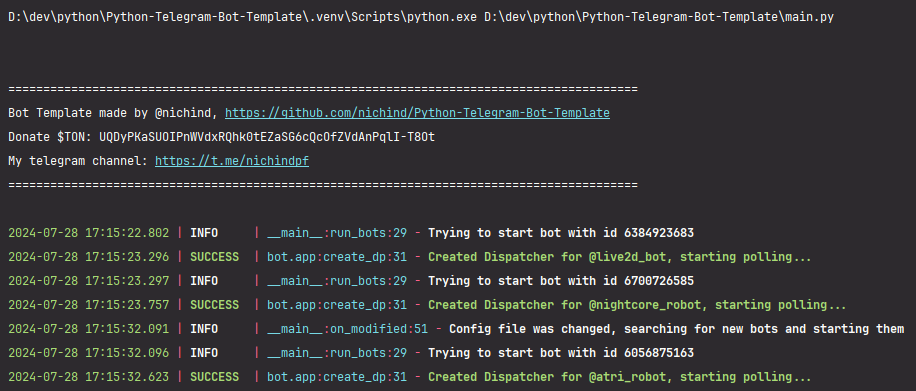

# Aiogram3 bot template
Easy to modify and use.
Run multiple bots in one time.
Add your bots while script is running: "on the fly", they will launch automatically.

## Install & Requirements

Make sure you have python that supports aiogram3 installed. (3.9+)

### Windows
1. Fork repository or click "Use this template" button to clone it
2. Download new repository to your machine
3. Create `config.json` file with your bot(s) token according to the `example-config.json`
4. Double-click on "run-in-venv.bat" file

### Other
1. Fork repository or click "Use this template" button to clone it
2. Download new repository to your machine
3. Create `config.json` file with your bot(s) token according to the `example-config.json`
4. Download python and install it
5. Create virtual environment using `python -m venv .venv`
6. Run `pip install -r requirements.txt` in your terminal
7. Run `python main.py` in your terminal

## Other
### Config example

```json filename="config.json"
{
  "bots": [
    "4512341245:AWCFFnxH-D16EASgs2Fso-h7oA4no0M"
  ],
  "admins": [
    1538946202
  ]
}
```

## Screenshots




PRs are welcomed

<br>
